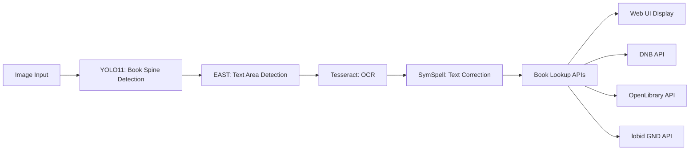

# Book Spine Recognition System - Implementation Plan

## Executive Summary

This implementation plan addresses the key quality issues in the book spine recognition system:
- OCR often fails to recognize German text properly
- Book lookups frequently fail even with clear titles
- Need for Swiss market-specific book sources
- Text detection and processing limitations

## Current System Overview



## Phase 1: OCR Language Support

### 1.1 Configure Tesseract for German
**Priority: HIGH**
**Effort: Low**

```python
# Current: No language specified
ocr_text = pytesseract.image_to_string(processed_image, config="--psm 6")

# Improved: Specify German + English
ocr_text = pytesseract.image_to_string(processed_image, lang='deu+eng', config="--psm 6")
```

**Tasks:**
- ~~[ ] Install German language pack for Tesseract (`tesseract-ocr-deu`)~~
- [x] Modify `ocr_utils.py` to accept language parameter
- [x] Update OCR calls to use appropriate language codes
- [x] Test with German book samples

### 1.2 Implement Language Detection
**Priority: MEDIUM**
**Effort: Medium**

```python
def detect_spine_language(image, text_sample=None):
    """Detect language from book spine image or text sample"""
    if text_sample:
        # Use langdetect on existing text
        return detect(text_sample)
    else:
        # Quick OCR sample for language detection
        sample = pytesseract.image_to_string(image, config="--psm 6")
        return detect(sample) if sample else 'de'
```

**Tasks:**
- [ ] Add `langdetect` library to requirements
- [ ] Implement language detection function
- [ ] Create language mapping (ISO 639-1 to Tesseract codes)
- [ ] Add fallback to German for Swiss market

### 1.3 Evaluate EasyOCR as Alternative
**Priority: LOW**
**Effort: High**

**Advantages:**
- Better multilingual support out-of-box
- Neural network-based (potentially better for stylized fonts)
- Handles rotated text better

**Tasks:**
- [ ] Install EasyOCR with German/English/French/Italian support
- [ ] Create comparison test suite
- [ ] Benchmark speed vs accuracy
- [ ] Implement as optional OCR backend

## Phase 2: Enhanced Book Lookup

### 2.1 Add Swiss Book Sources
**Priority: HIGH**
**Effort: Medium**

#### A. Swiss National Library (Helveticat)
```python
def search_helveticat(query_string, language="de"):
    """Search Swiss National Library catalog via SRU"""
    base_url = "https://sb-s2.swissbib.ch/sru/helveticat"
    params = {
        "operation": "searchRetrieve",
        "query": f'dc.title="{query_string}"',
        "maximumRecords": 5
    }
```

#### B. Swissbib (Meta-catalog)
```python
def search_swissbib(query_string):
    """Search unified Swiss library catalog"""
    # Covers university libraries, cantonal libraries, etc.
```

#### C. Commercial APIs for Swiss Market
- Google Books API with market parameter
- Orell Füssli API (major Swiss bookstore)
- Ex Libris API (Swiss book retailer)

**Tasks:**
- [ ] Research and document available Swiss APIs
- [ ] Implement Helveticat SRU client
- [ ] Add Swissbib search functionality
- [ ] Implement result ranking by source reliability

### 2.2 Implement Fuzzy Search Strategies
**Priority: HIGH**
**Effort: Medium**

```python
class BookSearchStrategy:
    def __init__(self):
        self.strategies = [
            self.exact_match,
            self.remove_subtitle,
            self.first_n_words,
            self.fix_common_ocr_errors,
            self.remove_special_chars,
            self.author_title_split
        ]
    
    def remove_subtitle(self, query):
        """Remove text after : or -"""
        return query.split(':')[0].split(' - ')[0].strip()
    
    def fix_common_ocr_errors(self, query):
        """Fix common OCR mistakes"""
        replacements = {
            'l': ['I', '1'],
            'I': ['l', '1'],
            '0': ['O'],
            'O': ['0'],
            'rn': ['m'],
            'ii': ['ü'],
        }
        # Apply replacements intelligently
```

**Tasks:**
- [ ] Implement search strategy framework
- [ ] Create OCR error correction patterns
- [ ] Add query variation generation
- [ ] Implement parallel search with multiple strategies
- [ ] Add result deduplication

### 2.3 Improve Search Ranking
**Priority: MEDIUM**
**Effort: Low**

```python
def rank_search_results(results, original_query, market="CH"):
    """Rank results by relevance and market proximity"""
    for result in results:
        score = 0
        # Title similarity
        score += fuzz.ratio(result['title'], original_query)
        # Swiss market preference
        if result.get('market') == 'CH':
            score += 20
        # German language preference
        if result.get('language') == 'de':
            score += 10
        result['relevance_score'] = score
    
    return sorted(results, key=lambda x: x['relevance_score'], reverse=True)
```

## Phase 3: Text Processing Improvements

### 3.1 Multi-language Dictionary Support
**Priority: MEDIUM**
**Effort: Medium**

**Current Issue:** Only German dictionaries loaded, but books may be in multiple languages.

**Tasks:**
- [ ] Extend dictionary loading for French, Italian, English
- [ ] Implement language-aware text correction
- [ ] Add Swiss-German specific terms
- [ ] Create author name dictionaries for other languages

### 3.2 Optimize Text Area Detection
**Priority: MEDIUM**
**Effort: Medium**

```python
# Adaptive kernel size based on image dimensions
def get_adaptive_kernel_size(image_height):
    # Smaller kernels for better text separation
    if image_height < 500:
        return (3, 3)
    elif image_height < 1000:
        return (5, 5)
    else:
        return (7, 7)

# Multiple detection passes
def multi_pass_text_detection(image):
    # Pass 1: Conservative (less merging)
    boxes_conservative = detect_with_kernel((3, 3))
    
    # Pass 2: Aggressive (more merging)
    boxes_aggressive = detect_with_kernel((10, 10))
    
    # Intelligent combination
    return combine_detection_results(boxes_conservative, boxes_aggressive)
```

**Tasks:**
- [ ] Implement adaptive morphological operations
- [ ] Add multi-pass detection strategy
- [ ] Create heuristics for single vs multi-line detection
- [ ] Optimize for vertical text on spines

### 3.3 Context-Aware Text Processing
**Priority: LOW**
**Effort: High**

```python
class SpineTextProcessor:
    def process(self, ocr_results):
        # Identify text roles (author, title, publisher)
        classified = self.classify_text_regions(ocr_results)
        
        # Apply role-specific processing
        if classified['author']:
            classified['author'] = self.process_author_name(classified['author'])
        if classified['title']:
            classified['title'] = self.process_book_title(classified['title'])
            
        return classified
```

## Phase 4: System Integration

### 4.1 Configuration Management
**Priority: HIGH**
**Effort: Low**

```python
# config.py additions
SUPPORTED_LANGUAGES = ["de", "fr", "it", "en"]
DEFAULT_MARKET = "CH"
OCR_BACKEND = "tesseract"  # or "easyocr"

BOOK_SOURCES = {
    "CH": ["helveticat", "swissbib", "dnb", "openlibrary"],
    "DE": ["dnb", "openlibrary"],
    "DEFAULT": ["openlibrary", "lobid_gnd"]
}
```

### 4.2 Confidence Scoring System
**Priority: MEDIUM**
**Effort: Medium**

```python
class BookDetectionResult:
    def __init__(self):
        self.ocr_confidence = 0.0
        self.lookup_confidence = 0.0
        self.overall_confidence = 0.0
    
    def calculate_confidence(self):
        # OCR confidence from Tesseract
        # Lookup confidence from match quality
        # Overall weighted average
```

### 4.3 Web UI Enhancements
**Priority: LOW**
**Effort: Medium**

- Display confidence scores
- Show alternative search results
- Allow manual market selection
- Add language override option

## Testing Strategy

### Test Data Sets
1. **German Books**: 50 Swiss/German book spines
2. **Multilingual**: 20 French, 20 Italian, 20 English books
3. **Difficult Cases**: Stylized fonts, vertical text, old books
4. **Swiss Publishers**: Focus on local publishers

### Success Metrics
- OCR accuracy: >80% character accuracy for German text
- Lookup success: >70% successful lookups for clear titles
- Swiss market coverage: >60% of Swiss books found
- Processing speed: <5 seconds per book spine


## Risk Mitigation

1. **API Rate Limits**: Implement caching and request throttling
2. **Language Detection Failures**: Fallback to multi-language OCR
3. **Performance Impact**: Make new features optional/configurable
4. **Swiss API Availability**: Maintain fallback to international sources

## Next Steps

1. **Immediate Actions**:
   - Install German Tesseract language pack
   - Add language parameter to OCR pipeline
   - Research Swiss library APIs

2. **Short Term**:
   - Implement Helveticat integration
   - Add fuzzy search strategies
   - Test with Swiss book samples

3. **Medium Term**:
   - Complete multi-language support
   - Optimize text detection
   - Deploy confidence scoring

## Conclusion

This implementation plan prioritizes practical improvements that will have immediate impact on the system's ability to recognize and lookup German/Swiss books. The phased approach allows for incremental improvements while maintaining system stability.

The focus is on:
- Quick wins that can be implemented immediately (German OCR support)
- Swiss market-specific improvements (local book sources)
- Practical solutions over complex features (fuzzy search vs ISBN detection)
- Flexibility to adapt based on testing results